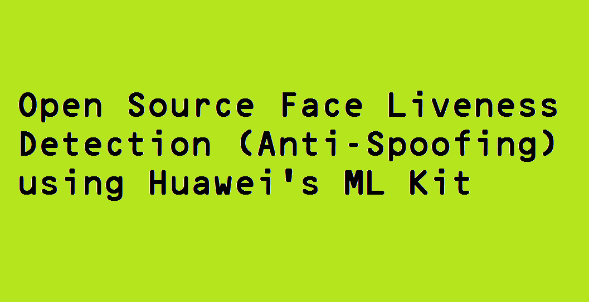

This repo contains source code using [Huawei's ML Kit for Liveness detection](https://developer.huawei.com/consumer/en/doc/development/HMSCore-Guides/liveness-detection-0000001051386243).
Our tests show **32.2% accuracy for Huawei on high resolution images while [Doubango's Liveness detection](https://www.doubango.org/webapps/face-liveness/) has 100% accuracy**:
  - Tests done on #50 4K images and #50 2K images
  - The images are displayed on MacBook Pro (Retina, 15-inch, Mid 2014)
  - The images are captured using a Galaxy S10+
  - The Galaxy S10+ is positioned at 3 different positions for each image: far, near, close
  - A sample image can be found [here](selfie.jpg). Huawei never managed to catch Print-Attacks on 4K images

Huawei's implementation may not be accurate enough for commercial applications but the [SDK is free](https://developer.huawei.com/consumer/en/doc/development/HMSCore-Guides/ml-service-billing-0000001051010023) and could be good candidate for open source projects.

The next [video](https://youtu.be/52W2K5yJIl4) ([https://youtu.be/4Z8VRTS8WrA](https://youtu.be/52W2K5yJIl4)) shows some tries using ML Kit (code in this repo).   

